# Architecture Documentation

This document describes the software architecture for the codebase based strictly on the components, modules, and dependencies present in the source graph.

---

## 1. High-Level Overview

The system is a Next.js application designed for AI-driven media generation, asset management, and interactive content workflow execution. It features a client-heavy frontend UI layer (`src/openhiggsfield/`), a backend/proxy media handling layer (`src/app/api/blob/`, `src/proxy.ts`), an abstracted IndexedDB and browser storage system, and an extensive AI model catalog with generation lifecycle orchestration (`src/generation/`).

---

## 2. Component Interaction Diagram

The following diagram illustrates the primary structural layers and dependency flows across the application:

```mermaid
graph TD
    subgraph NextJS App Layer
        Layout["src/app/layout.tsx"]
        Page["src/app/page.tsx"]
        BlobAPI["src/app/api/blob/route.ts"]
        Robots["src/app/robots.ts"]
        Sitemap["src/app/sitemap.ts"]
        Manifest["src/app/manifest.ts"]
    end

    subgraph OpenHiggsfield Application UI
        OHApp["src/openhiggsfield/openhiggsfield-app.tsx"]
        Composer["src/openhiggsfield/composer.tsx"]
        Gallery["src/openhiggsfield/gallery.tsx"]
        Viewer["src/openhiggsfield/viewer.tsx"]
        MediaTray["src/openhiggsfield/media-tray.tsx"]
        SettingsUI["src/openhiggsfield/settings.tsx"]
        ModelPicker["src/openhiggsfield/model-picker.tsx"]
        AssetPicker["src/openhiggsfield/asset-picker.tsx"]
        SelectionBar["src/openhiggsfield/selection-bar.tsx"]
        KeyModal["src/openhiggsfield/key-modal.tsx"]
        Topbar["src/openhiggsfield/topbar.tsx"]
    end

    subgraph Storage & Utilities Layer
        IDB["src/openhiggsfield/idb.ts"]
        History["src/openhiggsfield/history.ts"]
        Uploads["src/openhiggsfield/uploads.ts"]
        DataUtil["src/openhiggsfield/data.ts"]
        BrowserStore["src/generation/stores/browser-storage.ts"]
        Proxy["src/proxy.ts"]
    end

    subgraph Generation Core Layer
        Actions["src/generation/actions.ts"]
        Poll["src/generation/poll.ts"]
        Platform["src/generation/platform.ts"]
        ToPlatform["src/generation/to-platform.ts"]
        Plane["src/generation/plane.ts"]
        Credentials["src/generation/credentials.ts"]
        Device["src/generation/device.ts"]
        Upload["src/generation/upload.ts"]
    end

    subgraph Model Catalog Layer
        CatalogIndex["src/generation/catalog/index.ts"]
        ParseSettings["src/generation/catalog/parse-settings.ts"]
        Defaults["src/generation/catalog/defaults.ts"]
        ModelDefinitions["Model Files (Flux, Kling, Wan, etc.)"]
    end

    %% Entry points
    Layout --> Robots
    Robots --> Sitemap
    Page --> OHApp

    %% App UI Relationships
    OHApp --> Composer
    OHApp --> Gallery
    OHApp --> Viewer
    OHApp --> Topbar
    OHApp --> KeyModal
    OHApp --> SelectionBar
    OHApp --> Actions
    OHApp --> Poll
    OHApp --> ToPlatform
    OHApp --> CatalogIndex

    Composer --> SettingsUI
    Composer --> ModelPicker
    Composer --> AssetPicker
    Composer --> MediaTray
    Composer --> ParseSettings

    Gallery --> History
    Gallery --> Poll
    Viewer --> History

    %% Storage Dependencies
    History --> IDB
    Uploads --> IDB
    MediaTray --> Uploads
    MediaTray --> Proxy
    MediaTray --> Upload

    %% Generation Engine Workflow
    Actions --> Platform
    Actions --> Poll
    Actions --> CatalogIndex
    Actions --> Credentials
    Actions --> ToPlatform
    Actions --> ParseSettings
    Platform --> Credentials
    Platform --> BlobAPI
    
    BlobAPI --> Device
    BlobAPI --> IDB
    Proxy --> Device
    Proxy --> IDB

    %% Catalog Integration
    CatalogIndex --> ParseSettings
    ModelDefinitions --> Defaults
```

---

## 3. Layered Architectural Breakdown

### 3.1 Next.js Application Layer (`src/app/`, Root Configs)
Provides app routing, layout setup, metadata endpoints, and server/API handlers.

- **`src/app/layout.tsx`**: Defines `RootLayout`. Integrates site metadata and icon assets.
- **`src/app/page.tsx`**: Entry point page displaying `OpenHiggsfieldPage`.
- **`src/app/api/blob/route.ts`**: API endpoint handling POST requests for blob uploads and device-bound storage operations. Entities: `POST`, `readDeviceId`, `withDeviceCookie`, `withDevicePath`, `summarizeBlobEvent`.
- **`src/app/robots.ts`**, **`src/app/sitemap.ts`**, **`src/app/manifest.ts`**: SEO and app manifest configurations.
- **`next.config.ts`**, **`next-env.d.ts`**: Framework configuration and TypeScript environments.

### 3.2 OpenHiggsfield Application UI Layer (`src/openhiggsfield/`)
Encapsulates all frontend visual interfaces, interactive controls, and UI state consumers.

- **`openhiggsfield-app.tsx`**: Core client orchestrator (`OpenHiggsfieldApp`, `UndoBar`). Manages run statuses, errors, drafts, and integrates the composer, gallery, viewer, selection controls, and actions.
- **`composer.tsx`**: Multi-modal generation interface (`Composer`, `BatchStepper`).
- **`gallery.tsx`**: Virtualized grid interface for history/runs (`VirtualizedGrid`, `RunningTile`, `Empty`).
- **`viewer.tsx`**: Asset preview and inspecting component (`Viewer`).
- **`media-tray.tsx`**: Media bar supporting upload handling and media display (`MediaStrip`, `useMedia`, `useMediaTray`).
- **`settings.tsx`**, **`ui.tsx`**: Reusable form controls, field inputs, sliders, and popovers (`SettingPill`, `SettingPopover`, `Field`, `Option`, `Slider`).
- **`model-picker.tsx`**, **`asset-picker.tsx`**, **`selection-bar.tsx`**, **`key-modal.tsx`**, **`topbar.tsx`**: Auxiliary UI modals, model selection dropdowns, and header controls.
- **`icons.tsx`**: SVG icon library (`ImageIcon`, `VideoIcon`, `SlidersIcon`, etc.).

### 3.3 Storage, Utilities, & Persistence Layer
Handles local IndexedDB storage, browser storage synchronization, formatting, and file exports.

- **`src/openhiggsfield/idb.ts`**: Low-level IndexedDB key-value database wrapper (`memoryKv`, `idbKv`, `defaultKv`, `browserLegacy`, `open`, `request`).
- **`src/openhiggsfield/history.ts`**: Generation history persistence layer (`loadHistory`, `saveHistory`, `mergeHistory`, `replaceRequest`, `capHistory`, etc.).
- **`src/openhiggsfield/uploads.ts`**: Tracking local/remote upload metadata (`loadUploads`, `saveUploads`, `rememberUpload`, `coerceUpload`).
- **`src/openhiggsfield/data.ts`**: Data transformation and labeling helpers (`settingLabel`, `ratioToCss`, `describeModel`, `formatClock`).
- **`src/openhiggsfield/download.ts`**: Downloader engine (`saveFile`, `fileNameFor`).
- **`src/openhiggsfield/artwork.ts`**: Art and swatch generator (`artFor`, `swatchFor`, `hash`, `rng`).
- **`src/generation/stores/*`**: Local browser storage state stores:
  - `browser-storage.ts`: Generic storage abstraction (`browserStorage`, `read`, `write`).
  - `active.ts`, `prompt.ts`, `settings.ts`, `media.ts`: Isolated state stores.

### 3.4 Generation Core & Platform Engine (`src/generation/`)
Core domain logic for constructing, formatting, authenticating, and submitting generation tasks.

- **`actions.ts`**: Core execution entry point (`submitGeneration`, `getGenerationStatuses`, `savePlatformCredentials`, `readCredentials`).
- **`poll.ts`**: Request lifecycle watcher and polling scheduler (`watchRequest`, `stopWatching`, `schedule`, `sweep`, `settleAll`).
- **`platform.ts`**: External platform API interactions and status mappings (`createPlatformClient`, `mapStatus`, `mapQueued`).
- **`to-platform.ts`**: Map domain payloads to specific model platform structures (`toPlatform`, `mapSoul`, `mapKling3`, `mapSeedance`, etc.).
- **`credentials.ts`**: API credentials encoding, decoding, and parsing (`encodeCredentials`, `decodeCredentials`, `toAuthorizationHeader`).
- **`device.ts`**: Device identification and blob path sanitization (`mintDeviceId`, `resolveDeviceId`, `blobPathname`, `sanitizeFilename`).
- **`plane.ts`**: Generation plane builder (`assemblePlane`).
- **`upload.ts`**: File upload handler triggering blob API upload requests (`uploadMedia`).
- **`src/proxy.ts`**: Media proxy request router bridging device state and IndexedDB storage (`proxy`).

### 3.5 AI Model Catalog System (`src/generation/catalog/`)
Configurable system containing specifications, settings, and defaults for supported AI models.

- **`index.ts`**: Catalog entry lookup interface (`getModel`).
- **`parse-settings.ts`**: Dynamic model parameter parser (`parseSettings`).
- **`defaults.ts`**: Shared base settings (`t2v`, `imageModel`, `videoModel`).
- **`types.ts`**, **`tokens.ts`**, **`soul.ts`**: Shared catalog types and token declarations.
- **Model Definition Definitions**:
  - *Flux*: `flux-2.ts`, `flux-3.ts`
  - *Kling*: `kling-2.5.ts`, `kling-2.6.ts`, `kling-3.ts`, `kling-o1.ts`, `kling-o3.ts`
  - *Wan*: `wan-2.6.ts`, `wan-2.7.ts`, `wan-3.ts`, `wan-3-prime.ts`
  - *MiniMax*: `minimax-h3.ts`, `minimax-hailuo-2.3.ts`
  - *Grok*: `grok-imagine-2.ts`, `grok-imagine-video-1.5.ts`
  - *LTX*: `ltx-2.5-fast.ts`, `ltx-2.5-pro.ts`
  - *Seedance*: `seedance-2.ts`, `seedance-2.5.ts`
  - *Other Models*: `happy-horse-1.ts`, `happy-horse-1.1.ts`, `dop.ts`, `z-image-turbo.ts`, `pixverse-6.ts`, `ideogram-4.ts`, `qwen-image-3.ts`, `recraft-4.1.ts`

---

## 4. Key Execution Workflows

### 4.1 Generation Submission Lifecycle
1. User configures prompt, settings, and active model inside `Composer` (`src/openhiggsfield/composer.tsx`).
2. Parameters are parsed via `parseSettings` (`src/generation/catalog/parse-settings.ts`) against model definitions retrieved via `getModel` (`src/generation/catalog/index.ts`).
3. `submitGeneration` (`src/generation/actions.ts`) is invoked:
   - Encodes credentials using `readCredentials` / `credentials.ts`.
   - Transforms standard payloads to platform-specific parameters via `toPlatform` (`src/generation/to-platform.ts`).
   - Calls `createPlatformClient` (`src/generation/platform.ts`) to queue the request.
4. Active tasks are handed over to `poll.ts` (`watchRequest`), which polls for job settlement and streams status updates back to `openhiggsfield-app.tsx`.
5. Completed generation runs are stored in IndexedDB via `saveHistory` (`src/openhiggsfield/history.ts`).

### 4.2 Asset Upload Pipeline
1. Media uploads originate from `MediaTray` (`src/openhiggsfield/media-tray.tsx`).
2. Requests invoke `uploadMedia` (`src/generation/upload.ts`), hitting `/api/blob` (`src/app/api/blob/route.ts`).
3. `/api/blob` resolves the current device context using `readDeviceId` / `withDeviceCookie` (`src/generation/device.ts`) and stores binary data.
4. Upload references are persisted locally using `rememberUpload` / `saveUploads` (`src/openhiggsfield/uploads.ts`) into IndexedDB (`src/openhiggsfield/idb.ts`).